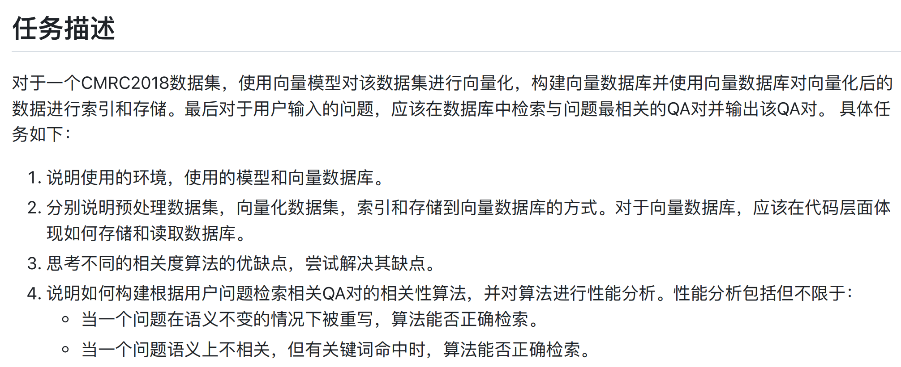
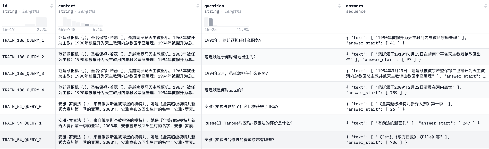
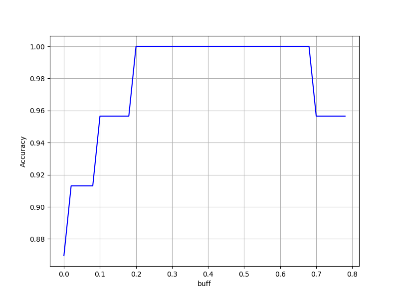

<style>
table
{
    margin: auto;
}
</style>

# 基于向量化模型和关键词重排的智能问答系统

## 项目背景🌃

项目来自学校数据库选修课程的老师布置的期末作业，任务描述如下：

<div style="text-align: center">

</div>

简单来说，需要借助已有的预训练向量模型对CMRC2018数据集中的每一个问题进行向量化，并对每一个用户问题向量化，依次根据向量相似度找到数据集中与之最接近的问题。不过，面对一些特殊问题（后文会提到），仅依赖句子内容的相似度来判断不同问题之间的相似度是不够的，还需要通过设计重排模型等方式提高判断的准确性。

## 项目架构🏠
```python
project/
│
├── data/  # 数据文件目录
│   ├── cmrc2018_train.json   # cmrc2018测试数据
│   └── cmrc2018_trial.json   # cmrc2018训练数据
│   └── ratings.xlsx   # 各向量模型在用户问题的评分
│   └── user_ques.xlsx   # 各向量模型在用户问题的评分
│   └── word_count.xlsx   # 各向量模型在用户问题的评分
│
├── import_sql/  # 处理raw data并导入数据库
│   └── embedding.py  # 向量映射
│   └── import_ques.py  # 将处理后的用户问题导入数据库
│   └── import_trial.py  # 将处理后的cmrc数据导入数据库
│   └── read_json.py  # 读取json文件
│   └── read_xlsx.py  # 读取excel文件
│
├── models/  # 存储模型权值文件
│   └── Dmeta-embedding-zh/..  # Dmeta模型，自行下载
│   └── gte-base-zh/..  # Gte模型，自行下载
│   └── stella-base-zh-v2/..  # Stella模型，自行下载
│   └── weights.pkl  # 各模型相似度权重
│
├── service/  # 主要业务
│   └── __init__.py  # 疑问词分类、权重模型存储
│   └── jieba_cut.ipynb  # 对cmrc训练数据做分词
│   └── rate_models.py  # 预训练向量模型评分
│   └── read_sql.py  # 读取sql文件
│   └── rerank.py  # 重排模型
│   └── test.py  # 测试最终模型
│   └── write_result.py  # 将评分结果写入excel
|
├── utils/  # 常用辅助工具
│   └── __init__.py  # 数据文件、模型文件存储路径
│   └── db_connect.py  # 创建数据库连接
│   └── text_tables.py  #  定义SQLAlchemy ORM模型类
│   
├── requirements.txt  # 记录项目所需packages
├── setup.py  # 导入项目到当前环境
```
（类似MVC架构）

可以新建一个conda环境(conda create --name vectordb python=3.8)，在终端运行pip install -e . --config-settings editable_mode=compat将Python项目安装到当前环境中，并运行pip install -r requirements.txt安装所需包。

## CMRC2018介绍📊

对于机器阅读理解 (MRC) 和自然语言处理的研究在近来变得非常流行，吸引了不少科研人员的关注。然而，现有的QA数据集大多是英文的，中文语料库少之又少。对此，Yiming Cui等人引入了一个用于中文机器阅读理解的 Span-Extraction [数据集](https://github.com/ymcui/cmrc2018/tree/master/data)，以增加该领域的语言多样性。该数据集由近 20,000 个真实问题组成，这些问题由人类专家在维基百科段落上注释。以train数据集举例，部分数据展示如下（截图来自[Hugging Face](https://huggingface.co/datasets/hfl/cmrc2018)）：

<div style="text-align: center">

</div>

其中，列"id"表示文本id，"context"表示文本内容，"question"表示问题，"answers"表示答案。由于project不要求根据文本内容来提取问题的答案，数据集中真正起到作用的只有列"question"。后续任务的embedding也是针对这一列文本来完成。

## 向量数据库🧭

为了存储文本数据和向量化结果，本文选取具有高扩展性、使用率高的[PostgreSQL](https://www.postgresql.org/download/windows/)作为向量数据库，并安装[pgvector插件](https://github.com/pgvector/pgvector)，还可以选择其他向量数据库（例如FAISS、Weaviate等）。

考虑到train数据量较多，处理起来较慢，本文主要基于[cmrc2018_trial.json](https://github.com/ymcui/cmrc2018/blob/master/data/cmrc2018_trial.json)来完成project。在项目开始前，需要建立两张表，包括"Trial"（存储Trial数据集）、"UserQuestions"（存储自定义用户问题）和"Test"（存储自定义用户问题，用于最终模型测试）。建表的sql语句分别如下：

```sql
-- DROP TABLE IF EXISTS "Trial";
CREATE TABLE "Trial"(
    "Id" SERIAL PRIMARY KEY,        -- 自动自增的主键
    "ContextId" TEXT,               -- QueryId 列
    "Context" TEXT,                 -- Context 列
    "Question" TEXT,                -- Question 列
    "Answers" TEXT,                 -- Answers 列
    "StellaEmbedding" vector(768),  -- Stella向量化
    "GteEmbedding" vector(768),     -- Gte向量化
    "DmetaEmbedding" vector(768)    -- Dmeta向量化
);
```

```sql
-- DROP TABLE IF EXISTS "UserQuestions";
CREATE TABLE "UserQuestions"(
    "Id" SERIAL PRIMARY KEY,        -- 自动自增的主键
    "Question" TEXT,                -- Question 列
    "IdealQuesId" Integer,          -- 对应"Trial"的Id
    "StellaEmbedding" vector(768),  -- Stella向量化
    "GteEmbedding" vector(768),     -- Gte向量化
    "DmetaEmbedding" vector(768),   -- Dmeta向量化
    "IsDelete" BOOLEAN              -- 是否删除
);
```

```sql
-- DROP TABLE IF EXISTS "Test";
CREATE TABLE "Test"(
    "Id" SERIAL PRIMARY KEY,        -- 自动自增的主键
    "Question" TEXT,                -- Question 列
    "IdealQuesId" Integer,          -- 对应"Trial"的Id
    "StellaEmbedding" vector(768),  -- Stella向量化
    "GteEmbedding" vector(768),     -- Gte向量化
    "DmetaEmbedding" vector(768),    -- Dmeta向量化
    "IsDelete" BOOLEAN              -- 是否删除
);
```

其中，"StellaEmbedding"、"GteEmbedding"和"DmetaEmbedding"分别对应几个预训练向量模型，在后文会提到。项目中，为了使代码更加简洁清晰，使用了SQLAlchemy ORM写法，具体可见代码文件。

## 自定义数据集以及各模型测试🔢

$\textbf{写在前头}$：各向量模型的预设应用场景不一定完全契合本问题，模型评分结果不一定能全面客观地说明模型好坏，仅供参考。

借助[MTEB](https://huggingface.co/spaces/mteb/leaderboard)中文预训练向量模型的评分排名，本文选取了映射维度为768的排名前三的不同模型模型，分别为[Dmeta-embedding-zh](https://huggingface.co/DMetaSoul/Dmeta-embedding-zh)、[gte-base-zh](https://huggingface.co/thenlper/gte-base-zh)和[stella-base-zh-v2](https://huggingface.co/infgrad/stella-base-zh-v2)。可通过计算两文本向量化结果的余弦相似度量化两文本的相似度，公式如下：

$$ Similarity = \frac{\vec{v_a} \cdot \vec{v_b}}{\| \vec{v_a} \| \| \vec{v_b} \|} $$

模型能否正确找出用户问题所对应的题库问题？这需要通过自定义数据集进行测试，可通过在[trial数据集](project\data\cmrc2018_trial.json)基础上修改语序、变换问法、多问句结合完成。示例如下：

```sql
（原句）“龙胆又被称之为什么？”、“中医上，是如何使用龙胆的？”-> （改写）“中医上，龙胆又叫什么？”
（原句）“第一届《绝对SuperStar》的女子组指定演唱的是哪首歌？”->（改写）“女子组在第一届《绝对SuperStar》中，演唱的是哪首歌？”
```

本项目所使用的自定义数据可定位至[data目录](project\data\user_ques.xlsx)。

如何对不同模型在自定义数据集上的表现进行评分呢？主要在于三方面，一是问题判断是否正确，二是若判断正确，自定义问题与原问题的相似度是否足够大，三是若判断正确，自定义用户问题与其他问题的相似度是否足够小。对此，对于每个预训练向量模型，建立评分模型如下：

$$
Rating = 
\sum_{i=1}^{n}r_i(\alpha sim(v_0, v_1)- \frac{\beta}{K-1} {\textstyle \sum_{j=2}^{K}sim(v_0, v_j)}-(1-r_i))
$$

其中，$n$表示自定义数据量，$r_i$表示是否判断正确（正确取1，不正确取0），$v_0$表示原问题向量，$v_i(i=1, 2,...,K)$表示问题向量和原问题相似度从大到小的排序结果，K表示需要计算的问题向量的数量。在实际计算中，$\alpha$和$\beta$的取值分别为1和0.25，K的取值为11。各模型评分结果如下：

| Question | IdealQuestionId | StellaRating | GteRating | DmetaRating |
| :-------------------: | :---:| :------:| :------:| :------: |
| 尤金袋鼠大约多重？                                    | 8               | 0.8282       | 0.8035    | 0.8254      |
| 女子组在第一届《绝对SuperStar》中，演唱的是哪首歌？ | 751             | 0.8321       | 0.785     | 0.7889      |
| 中医上，龙胆又叫什么？                               | 870             | 0.7354       | -1        | 0.711       |
| 位于泰国的乍都节公园有多大？                        | 17              | 0.7783       | 0.7614    | 0.7695      |
| 什么战术是单打世界排名前十的佩内塔擅长的？          | 24              | 0.7263       | 0.7166    | 0.7259      |
| 冰雪皇后冰淇淋离开了台湾市场，其特点有哪些？          | 70              | -1           | -1        | 0.6535      |
| 被曹永廉公开赞赏的蒋家旻在什么电影中第一次担当女一号？| 126             | 0.7362       | 0.7298    | 0.7381      |
| 卡塞雷斯老城区被列为世界文化遗产，2007年有多少人居住在这里？ | 525            | -1           | -1        | 0.7483  |
| $\vdots$       | $\vdots$     | $\vdots$     | $\vdots$   | $\vdots$     |
| 非洲野驴和印度野驴有一些区别，其中印度野驴栖息在哪儿？ | 257             | -1           | -1        | -1          |

其中，IdealQuestionId表示用户问题Question所对应的表“Trial”里的问题Id。直接把出现错判的用户问题和对应模型展示出来，结果如下：

|  模型  | 用户问题 | 错判问题 | 真实问题 |
| :--------:| :-----------------: | :---------------:| :--------------:|
| Stella | 冰雪皇后冰淇淋离开台湾市场，其特点有哪些？ | 冰雪皇后什么时候退出了台湾市场？ | 冰雪皇后冰淇淋有什么特点？ |
| Stella | 非洲野驴和印度野驴有一些区别，其中印度野驴栖息在哪儿？ | 印度野驴与非洲野驴的分别是什么？ | 印度野驴栖息在哪儿？ |
| Stella | 卡塞雷斯老城区被列为世界文化遗产，2007年有多少人居住在这里？| 卡塞雷斯老城区是何时被列为世界文化遗产的？ | 2007年，卡塞雷斯的人口有多少？ | 
| Gte | 中医上，龙胆又叫什么？ | 中医上，是如何使用龙胆的？ | 龙胆又被称之为什么？ |
| Gte | 冰雪皇后冰淇淋离开台湾市场，其特点有哪些？ | 冰雪皇后什么时候退出了台湾市场？ | 冰雪皇后冰淇淋有什么特点？ |
| Gte | 卡塞雷斯老城区被列为世界文化遗产，2007年有多少人居住在这里？| 卡塞雷斯老城区是何时被列为世界文化遗产的？ | 2007年，卡塞雷斯的人口有多少？ | 
| Gte | 非洲野驴和印度野驴有一些区别，其中印度野驴栖息在哪儿？ | 印度野驴与非洲野驴的分别是什么？ | 印度野驴栖息在哪儿？ |
| Dmeta | 非洲野驴和印度野驴有一些区别，其中印度野驴栖息在哪儿？ | 印度野驴与非洲野驴的分别是什么？ | 印度野驴栖息在哪儿？ |

以“非洲野驴...”举例，干扰句方面，“非洲野驴...区别”占了句子的大部分，而真正的问题“印度野驴栖息在哪儿”只占了小部分，这容易导致无关句在计算相似度时的比重过大，从而产生问句定位不准确的问题。而且不难发现，这类出现错判的句子整体评分相对偏低，也就是说，干扰项对不同问句间的相似度判断也造成了一定影响。为了有效解决这一问题，在后文将介绍关于问句类型判断的重排模型。

## 模型融合🤝

当前需要做的工作就是在向量化模型的判断基础上，结合问句类型加以判断最符合用户问题的问句。主要分为模型融合和重排模型两部分。对于前者，本文的思想是根据上一节的评分进行初排，用户问题相似度和trial数据集问题的相似度计算公式如下：

$$ simi(v_0, v_1) = weight_{Stella} * simi_{Stella}(v_0, v_1) + weight_{Gte} * simi_{Gte}(v_0, v_1) + weight_{Dmeta} * simi_{Dmeta}(v_0, v_1) $$

其中，$v_0$表示用户问题向量化结果，$v_1$表示数据集问题向量化结果，$weight_{Stella}$表示Stella模型相似度所占权重，$simi_{Stella}(v_0, v_1)$表示Stella模型计算所得相似度（其他变量同理）。权重weight如何计算呢？根据之前计算的ratings的比较，主要分为以下三种情况：

1、当三个模型对于一个用户问题的判断均正确时，假定$rating_{i, Stella}$ < $rating_{i, Gte}$ < $rating_{i, Dmeta}$（i表示第i个用户问题）,则有（其他情况同理）

$$ 
score_{i, Stella}=0, \ score_{i, Gte}=\frac{rating_{i, Gte} - rating_{i, Stella}}{rating_{i, Dmeta} - rating_{i, Stella}} rating_{i, Dmeta}, \  score_{i, Dmeta}=rating_{i, Dmeta}
$$

2、当其中一个模型判断错误，其他两个模型判断正确时，假定$rating_{i, Stella}=-1$，$rating_{i, Gte}$ < $rating_{i, Dmeta}$，则有

$$ 
score_{i, Stella}=-1, \  score_{i, Gte}=0, \  score_{i, Dmeta}=rating_{i, Dmeta}
$$ 

3、当其中只有一个模型或没有模型判断正确时，则有

$$ 
score_{i, Stella}=rating_{i, Stella}, \ score_{i, Gte}=rating_{i, Gte}, \ score_{i, Dmeta}=rating_{i, Dmeta}
$$ 

取$score_{Stella} = max(aver(score_{Stella}), \ 0)$, $score_{Gte} = max(aver(score_{Gte}), \ 0)$, $score_{Dmeta} = max(aver(score_{Dmeta}), \ 0)$，以Stella权重的计算为例，权重计算如下：

$$
weight_{Stella} = \frac{score_{Stella}}{score_{Stella}+score_{Gte}+score_{Dmeta}}
$$

最终计算得到 $weight_{Stella}=0.542$，$weight_{Gte}=0$，$weight_{Dmeta}=0.458$。

## 重排模型⛰️

为了更全面客观地记录对于问句类型起到关键作用的词语，我们对[train数据集](project\data\cmrc2018_train.json)中所有问句统计分词结果，词云图如下：

<div style="text-align: center">

</div>

考虑表UserQuestions中的问题分词以及train数据集出现次数大于等于3的判断问句类型的关键词语，记录如下：

| 问句类型 | 关键词 |
| :----------: | :--------------------------------------: |
| 地点       | 哪里, 地方, 地区, 哪儿, 何地, 哪些地方, 何处 |
| 时间       | 时候, 哪一年, 时间, 时期, 哪年, 何年, 多长时间, 几年, 多少岁, 何时, 多少年 |
| 人物       | 谁, 名字，哪位   |
| 数量       | 多少, 几个, 几条    |
| 方式       | 怎样, 如何, 怎么 |
| 判断       | 是否   |
| 选择       | 哪个, 哪家, 哪国, 哪一, 哪部, 哪一部, 何种 |
| 原因       | 为什么, 为何, 原因  |
| 评价       | 什么样, 怎么样    |

对于给定的用户问题，借助融合模型从Trial问题集中选出相似度排前三的问题向量，再判断问题间是否有相同类型的关键词（在极少数情况下，一个问题可能有多个问句类型，若问句类型有重叠也视为问句类型相同）。在前文讨论过，当相似度评分较低时容易出现错判，不妨引入超参数buff，并用$score_{i, j}$表示第i个用户问题和第j个候选问题的相似度评分，模型重排规则如下：

* 1、当用户问题和候选问题的问句类型都无法确定时，不改变 $score_{i, j}$

* 2、当用户问题和候选问题的问句类型仅有一个无法确定时，$score_{i, j}=score_{i, j} - buff * (1 - score_{i, j})$

* 3、当用户问题和候选问题的问句类型都能确定，但没有交集时，$score_{i, j}=score_{i, j} - buff * (1 - score_{i, j})$

* 4、当用户问题和候选问题的问句类型都能确定，而且存在交集时，$score_{i, j}=score_{i, j} + buff * (1 - score_{i, j})$

重排后，再选出score最高的候选问题。参数buff取多大合适呢？对于用户问题集UserQuestions，绘制不同buff取值下的问题判断准确率如下：

<div style="text-align: center">

</div>

buff取值在区间 [0.20, 0.68] 之间时，准确率等于1。本项目直接取0.4作为buff的最终取值。

## 模型测试及未来展望📖

本项目邀请了未了解模型内容的人员根据表"Trial"内容设计表"Test"中的问题，并进行消融实验，准确率结果如下：

| 模型 | 准确率 |
| :--------------: | :-----: |
| Stella | 0.89 |
| Gte | 0.82 |
| Dmeta  | 0.91   |
| 融合模型（三模型加权求和）  | 0.89  |
| 融合模型+重排模型  | 0.94 |

不难看出，引入模型融合思想和重排思想后，模型准确率可达到0.94，相比其它模型有着较为明显的提升。（By the way， 可能Gte模型不适合做这类问题，效果并不理想）。当然，通过探究本项目模型错判的例子，也能发现一些可以进一步改进的方面，包括如下：

1、问句类型判断方法不全面。

例如问句：“高英是高句丽高家嫁入北魏皇家的皇后，她嫁给了北魏皇家的哪个皇帝？”，本应对应“高英是哪位皇帝的皇后？”，但错判成“高英是高句丽高家嫁入北魏皇家的第几位皇后？”，真实问题和测试问题都是“人物”类，而错判问题不是，但是目前重排模型无法判断，后续可以进一步完善重排规则。

2、同一问句类型下，无法有效排除干扰项。

模型改进部分只考虑了不同问句类型的情况，但是同一问句类型下，重排模型无法发挥作用，导致问句干扰项无法被排除。例如问句：“莎莉多谢您」是莎莉公司在东南亚的广告语，莎莉公司建立初期主要卖什么？”，本应对应“莎莉公司初时主要售卖什么？”，但错判成“莎莉公司在东南亚的广告语是什么？”。虽然这几个问句类型相同，但是实际问题完全不同。后续可以进一步探究在相同问句类型下，如何更加有效地区分实际问句内容。当然工作量也会大很多。
